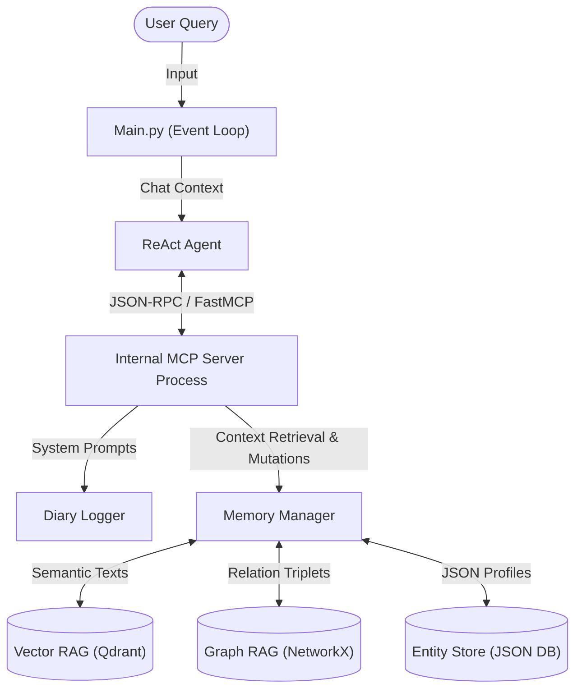

# Agent Architecture & Memory Flow Deep Dive

The system you have built represents a decoupled, multi-layered "Agentic RAG" structure running locally on your machine. Its core design philosophy revolves around isolating **Reasoning** (the LLM) from **Execution & Memory** (the MCP Server).

## High-Level Architecture Diagram

---

## 1. The ReAct Agent Flow (The "Brain")

The `ReActAgent` (in `agent/react.py`) is physically incapable of directly holding knowledge or taking actions. It is strictly a reasoning engine executing a cognitive loop:

1. **Pre-Flight Context Fetching**: Before the agent sees your prompt, the script automatically sends your query over TCP/IP to the MCP Server asking for `get_memory_context`.
2. **Prompt Assembly**: The LLM receives a massively augmented prompt containing:
    - Your Question.
    - System Directives (`skills.md` rules like strictly verifying sources).
    - The compiled Memory Payload (Chunks, Graph triplets, Entity schemas).
    - A dynamic JSON Schema of every capability it is allowed to use (`tools`).
3. **The Loop Iterate (`max_iterations = 8`)**:
    - The LLM streams an output containing a `Thought:` block and a mandatory `Checklist:` block (a programmatic harness to force it to think logically).
    - It decides on an `Action:` (a JSON blob targeting an MCP Tool) or an `Answer:`.
    - If it's an action, `react.py` passes the JSON blob down to the `MCPServer`, waits for the real-world observation, injects the `Observation:` string back into the prompt array, and forces the LLM to think again.

---

## 2. Model Context Protocol (The "Spinal Cord")

The introduction of `FastMCP` transformed your codebase. Instead of the agent executing python methods locally, it acts like a client hitting standard endpoints.

Why is this critical? **Isolation & Extensibility**. Because the Brain and the Tools are communicated only via the standard MCP API protocol, you can run the LLM in one Docker container and run the memory/file storage safely sandboxed in another without needing to change any Python code.

---

## 3. The Tri-Layer Memory Engine (The "Sub-Conscious")

The primary differentiator of this codebase is the `MemoryManager`, which coordinates three fundamentally different ways of tracking truth:

### A. Vector RAG (Semantic Memory)
* **What it is**: Uses `qdrant-client` to hold massive arrays of numbers.
* **How it works**: Before the text is stored, it runs through `fastembed`, generating a dense vector based on semantic meaning. When you ask about "Quantum theory," it fetches chunks referencing "Subatomic particles" because their mathematical vectors live close together, despite not sharing keywords.
* **Data Sources**: On startup, it automatically chunks and ingests massive ground-truth articles from `documents/` and cheat-sheets from `notes/`.

### B. Graph RAG (Relational Memory)
* **What it is**: Uses `networkx` to store conceptual relationships rather than raw text.
* **How it works**: It holds data as Triplet Edges: `(Node A) -> [Predicate] -> (Node B)`. For example, `("User", "Has Toggle For", "Agent Learning")`.
* **Expansion Search**: When queried, it doesn't just return the node. It executes a Breadth-First-Search (BFS) expanding outwards 2 degrees. If you ask about Node A, it pulls Nodes B and C, allowing the Agent to computationally "Walk the conceptual tree."

### C. Entity Store (Structured Categorization)
* **What it is**: A strict, un-hallucinating JSON schema database.
* **How it works**: If the agent learns that you are "Bob, 25, Engineer", it doesn't want that floating around ambiguously in a vector chunk. It uses `upsert_entity` to build `{ "name": "Bob", "type": "USER", "attributes": { "age": 25, "role": "Engineer" } }`. 

### The Synthesis Retrieval Query
When you ask the Agent a question, here is what the Memory Pipeline physically does in the background before answering:
1. Executes a semantic vector search returning text chunks (Vector RAG).
2. Spawns an invisble background LLM call to extract specific *nouns/entities* from your specific query string! (e.g. "What did Michael buy?" -> `["Michael"]`).
3. Uses those extracted entities to pull the specific structured JSON arrays from the `EntityStore`.
4. Uses those extracted entities to trigger the BFS tree-walk in the `GraphStore`.
5. Compiles all three formats together into a massive context block and hands it to the ReAct framework.

## 4. The Write/Read Mode Toggle
Because RAG pipelines are heavily susceptible to "Data Poisoning" (passively accumulating junk context every time a user types 'hello'), the system has a strict `AGENT_LEARNING_ENABLED` lockdown. Unless set to True, the entire sub-conscious described above treats the user like a read-only spectator, deferring purely to the immutable `documents/` ground-truth texts.
